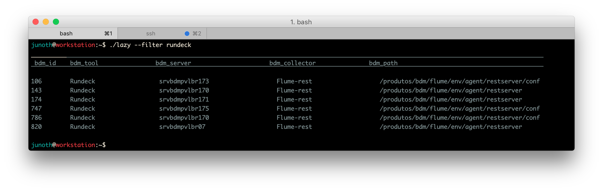

# Lazy Python Script
Este script permite realizar pesquisas no banco de dados MySQL de coletores alocado no servidor **srvbdrivlbr02.bs.br.bsch**.
Atualmente a solução é composta de uma WebView, o qual você pode ver através deste [link](http://srvbigpvlbr02.bs.br.bsch:3000/tools) e de um script que pode ser executado desde um workstation que tenha instalado **Python 2.7**.
<br/>
<br/>
## Download & Setup
Para descargar o script tem que executar o comando:
```shell
$ sudo su
$ wget http://srvbigpvlbr02.bs.br.bsch:3000/tools/lazy
$ chmod 775 lazy
$ cp lazy /usr/bin/
```

## Convertir Flume config a JSON
Para converter um arquivo de configuração de flume a JSON:
```shell
$ lazy --json example.properties
```
Depois, é só especificar o ambiente (HK/PRD) e o projeto (BDM/BDR)

## Listar todos os coletores
Para mostrar todos os coletores cadastrados no banco de dados:
```shell
$ lazy --list
```

## Filtrar coletores
Este comando permite filtrar os elementos usando um string como parâmetro:
```shell
$ lazy --filter rundeck
```

## Mostrar detalhe de um coletor
Este comando permite mostrar os detalhes de um item usando como parâmetro o 
*bdm_id* do registro:
```shell
$ lazy --get 820
```

## Cadastrar um coletor
Para cadastrar um coletor no banco de dados é necessário passar o path absoluto do arquivo de configuração (.properties) como parâmetro:
```shell
$ lazy --put /produtos/bdm/flume-agent/
```
Uma vez cadastrado o coletor, o script vai mostrar o *bdm_id*. Você pode conferir os detalhe com a opção **--get** ou **--filter** do script.

## Apagar um elemeto
Este comando permite apagar um elemento do banco de dados usando o **bdm_id** como parâmetro:
```shell
$ lazy --delete 936
```


